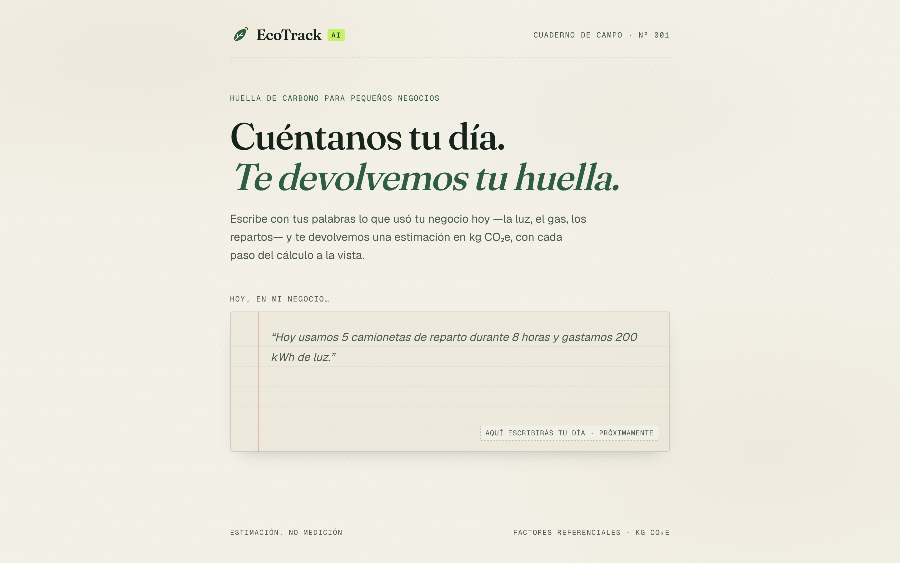
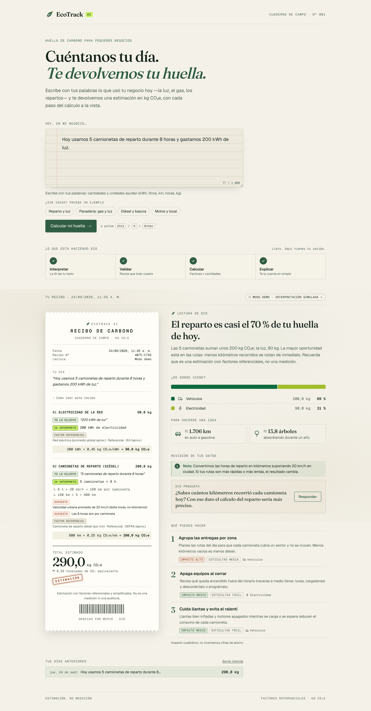
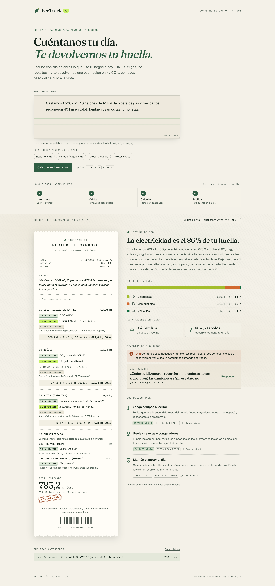
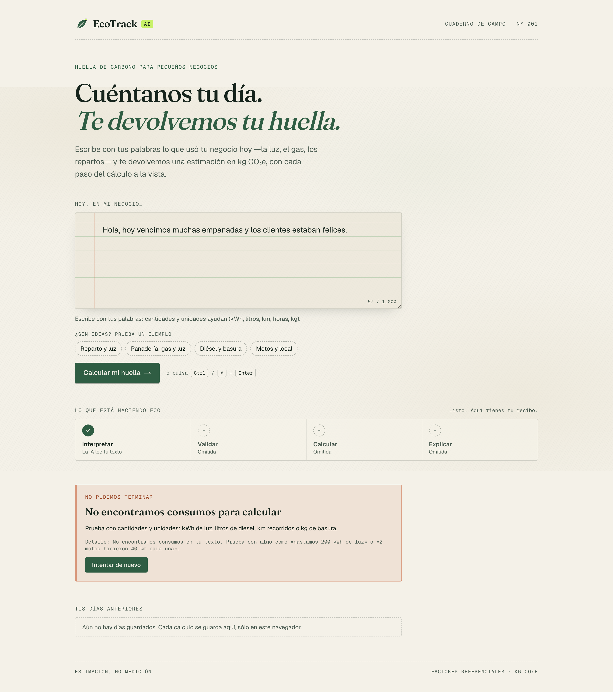
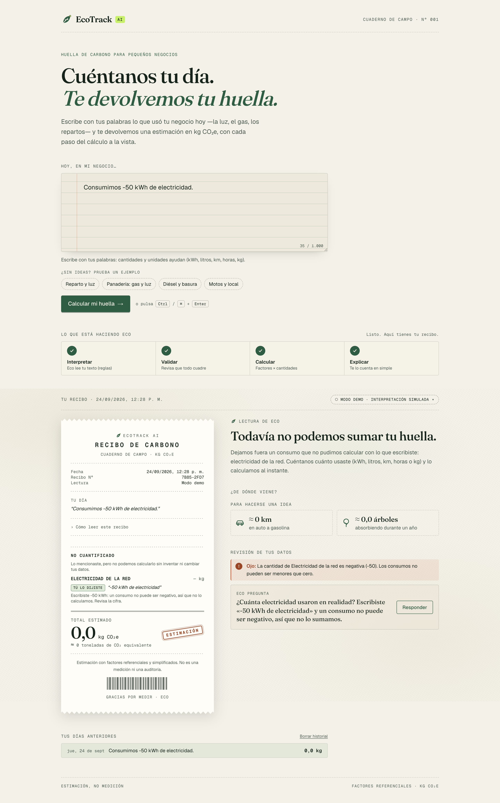
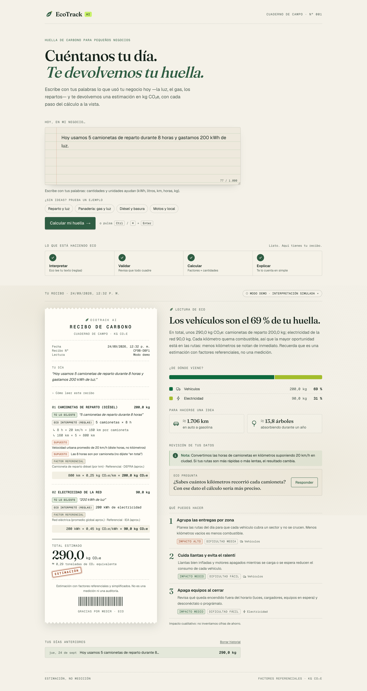
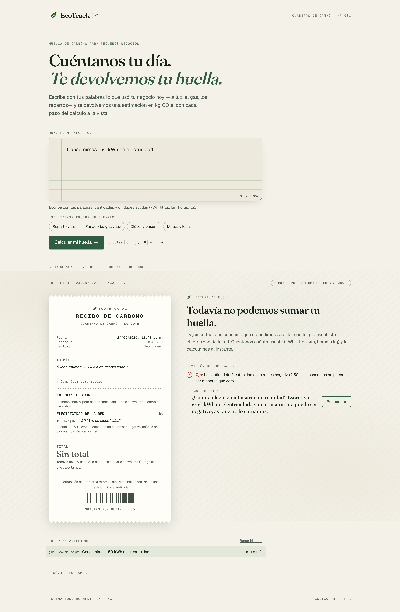
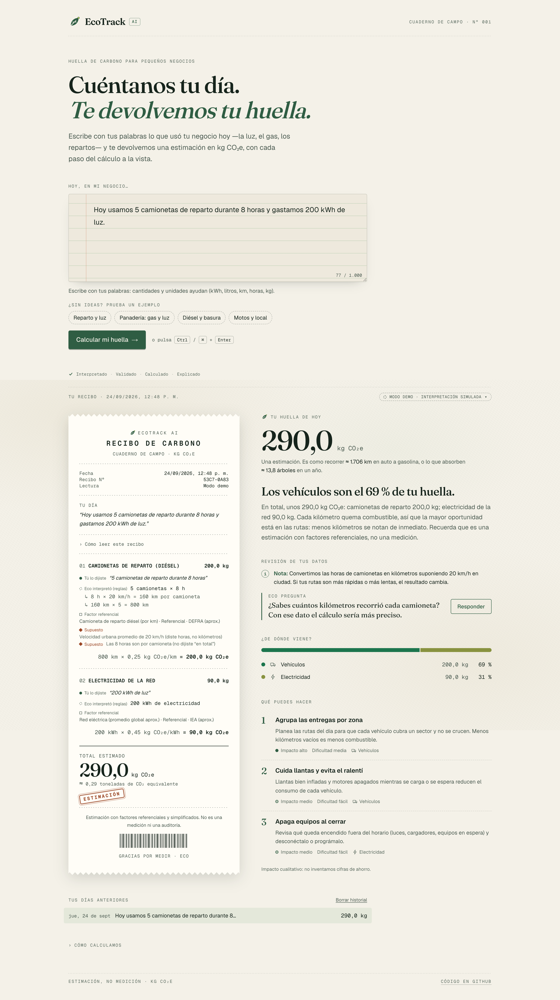
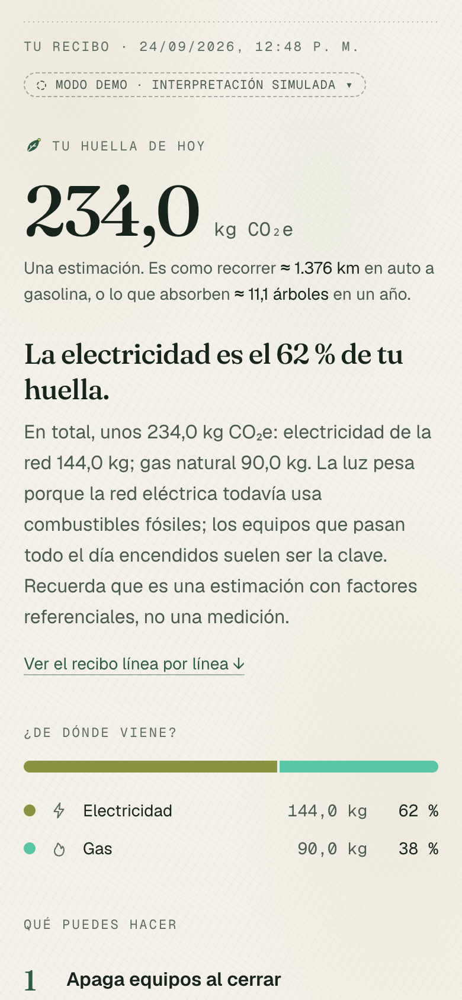

# Bitácora de Vibe Coding — EcoTrack AI

**Proyecto Integrador Capstone: "De la Idea a la Realidad con Vibe Coding"**

| | |
|---|---|
| Producto | EcoTrack AI: huella de carbono en lenguaje natural para pequeños negocios |
| Proyecto vivo | https://ecotrack-vibecoding.vercel.app |
| Repositorio | https://github.com/Juanseom/ecotrack-vibecoding |
| Fecha | 24 de septiembre de 2026 |
| Herramienta de Vibe Coding | Claude Code (agente principal + sub-agentes generadores de código) |
| Stack | Next.js 16 · React 19 · Tailwind 4 · TypeScript · Claude API + Zod · Vitest · Playwright · Vercel |

> Este documento resume el proceso. El registro detallado de cada iteración está en [`vibe-log.md`](vibe-log.md) y cada prompt se conserva completo en [`prompts/`](prompts/). **Todas las capturas son reales** (Playwright sobre la app en ejecución) y **todos los resultados provienen de ejecuciones reales**.

---

## 1. Estrategia de Vibe Coding

El proyecto se dirigió con prompts en tres capas, más una cuarta dentro del producto:

| Capa | Qué es | Dónde |
|---|---|---|
| 1. Prompt de dirección | El documento del estudiante que nombra a Claude Code agente principal del Capstone, con la regla de no inventar evidencia. | Punto de partida |
| 2. **Master Prompt** | Contexto completo: problema, usuario, alcance cerrado, factores de emisión, flujo, vibe (paleta, tipografías, tono de "Eco"), arquitectura, reglas y criterios de calidad. | [`master-prompt.md`](master-prompt.md) |
| 3. **Prompts de iteración** | Una instrucción concreta por iteración, **guardada antes de ejecutarse** y entregada tal cual a un sub-agente de Claude Code con contexto limpio. El sub-agente sólo conoce el Master Prompt, el prompt y el repo, así que el resultado depende de la calidad del prompt, como en Cursor o Bolt. | [`prompts/`](prompts/) |
| 4. Prompts del producto | Los 4 prompts que EcoTrack AI envía a Claude en tiempo de ejecución. | [`ai-prompts.md`](ai-prompts.md) |

El agente principal hizo de director: escribió los prompts, revisó cada resultado (build, lint, pruebas y capturas), decidió la siguiente iteración y documentó. No escribió código del producto a mano.

**Técnicas de prompting usadas en los prompts de iteración:**
- **Contrato primero.** El prompt de la iteración 2 fijó literalmente `src/lib/types.ts`, así que la API de la iteración 3 encajó sin rehacer la UI.
- **Un "hueco" explícito.** La iteración 3 pidió una interfaz `Interpreter` para que Claude reemplazara al intérprete demo en la 4 sin tocar UI ni cálculo.
- **Criterios de aceptación verificables** en todos los prompts: `build`, `lint` y `test` en verde, y casos `curl` concretos.
- **Separación de roles.** La QA (iteración 5) tenía prohibido arreglar; el debugging (iteración 6) debía diagnosticar **antes** de tocar código.
- **Lenguaje natural para el diseño.** La iteración 7 se redactó como una petición humana ("más verde, menos arcoíris").
- **Honestidad como requisito.** "No tienes API key: no inventes resultados de llamadas reales."

## 2. Prompts principales

### 2.1 Master Prompt (extracto)
> *Eres un equipo senior de producto (PM, diseñador UX/UI, arquitecto, desarrollador full-stack, ingeniero de IA) construyendo el MVP de EcoTrack AI. […]* **Propuesta de valor:** *"Cuéntanos tu día. Te devolvemos tu huella."* […] **Regla 1:** *La IA extrae y explica; el código calcula. Nunca mostrar kg CO₂e generados por un LLM.* […] **Concepto visual:** *cuaderno de campo + recibo de papel reciclado + precisión técnica. No es un dashboard corporativo con tarjetas genéricas.*

Texto completo: [`master-prompt.md`](master-prompt.md).

### 2.2 Prompts de iteración

| Iter. | Prompt | Frase clave del prompt | Resultado |
|---|---|---|---|
| 1 | [Estructura](prompts/iter-01-estructura.md) | "Dejar un proyecto Next.js que compila, con el sistema de diseño de EcoTrack AI configurado y una página inicial que ya transmita la identidad." | Proyecto base, tokens, tipografías, portada |
| 2 | [Interfaz](prompts/iter-02-interfaz.md) | "Construir toda la interfaz del flujo principal, alimentada por un resultado de ejemplo fijo… respeta exactamente el contrato de tipos." | 14 componentes, recibo de carbono |
| 3 | [Flujo principal](prompts/iter-03-flujo-principal.md) | "La arquitectura debe dejar un 'hueco' para que en la iteración 4 un intérprete con Claude reemplace al intérprete demo sin tocar la UI ni el motor de cálculo." | Motor, API en streaming, modo demo |
| 4 | [Integración de IA](prompts/iter-04-integracion-ia.md) | "Claude nunca recibe la instrucción de calcular kg CO₂e." + los 4 prompts de producto | `ClaudeInterpreter` con 4 llamadas |
| 5 | [Pruebas](prompts/iter-05-pruebas.md) | "Tu trabajo es encontrar problemas, no arreglarlos." | Matriz 17/19, 2 fallos + 5 defectos de UI |
| 6 | [Debugging](prompts/iter-06-debugging.md) | "Fase 1 — Diagnóstico (sin tocar código)… No propongas parches que sólo oculten el síntoma." | 19/19, 26 pruebas de regresión |
| 7 | [Refinamiento visual](prompts/iter-07-refinamiento-visual.md) | "Quiero que la app se sienta más minimalista, más tranquila y más verde… Primero el número, después el detalle." | Rediseño antes/después |

### 2.3 Prompts de IA del producto
Extracción, Validación, Análisis y Recomendaciones: ver la sección 4 y el texto literal en [`ai-prompts.md`](ai-prompts.md).

## 3. Proceso de iteración (con capturas)

### Iteración 0 · Definición (11:05)
Análisis del taller, rúbrica convertida en 20 criterios verificables ([`01-analisis-taller.md`](01-analisis-taller.md)), Master Prompt, arquitectura y roadmap. Decisión central: **la IA interpreta, el código calcula**, y el resultado se presenta como un "recibo de carbono" para que la trazabilidad se vea.

### Iteración 1 · Estructura (11:13)
Primera generación: Next.js 16 + Tailwind 4 con la paleta papel/bosque/musgo y las fuentes Fraunces + Geist Mono. Primer problema real: conflicto de dependencias `ERESOLVE` entre Vitest 5 y `@types/node@20`, resuelto por la IA ([incidente #1](debugging.md)).



### Iteración 2 · Interfaz (11:27)
Toda la interfaz sobre un contrato de tipos, con datos de ejemplo: composer de cuaderno, pipeline de 4 etapas, recibo de papel con bordes dentados e insignias de origen del dato, desglose y recomendaciones.



### Iteración 3 · Flujo principal (11:47)
Motor de cálculo determinista, API `/api/analyze` en streaming NDJSON e intérprete por reglas. La app ya funciona con cualquier texto: aquí, 2 consumos no cuantificables que **no se inventan** y un aviso de doble conteo. Al revisar esta captura, el agente principal detectó un problema de honestidad: en modo demo el recibo decía "IA interpretó" ([incidente #4](debugging.md)).



### Iteración 4 · Integración de IA (11:56)
`ClaudeInterpreter` con 4 prompts y salidas validadas con Zod. Se probó contra la API real con una clave inválida (401 → mensaje humano). **El estudiante decidió no proporcionar API key**, así que no hay análisis reales generados por Claude; la demo usa el intérprete por reglas y lo declara.

### Iteración 5 · Pruebas (12:16)
Un agente QA escribió un arnés de 19 casos y pruebas de interfaz: **17/19**. Fallos reales: "-50 kWh" calculado como +50 sin aviso; `{}` clasificado mal; el pipeline decía "Listo. Aquí tienes tu recibo." sobre un error.



### Iteración 6 · Debugging con IA (12:31)
Diagnóstico escrito antes de tocar el código, pruebas de regresión y corrección: **19/19**, 180 pruebas. Detalle en la sección 5.



### Iteración 7 · Refinamiento visual en lenguaje natural (12:45)
Petición: *"más minimalista, más tranquila y más verde… primero el número, después el detalle… más verde, menos arcoíris… cuando no hay nada que sumar, no finjas."*

| Antes | Después |
|---|---|
|  |  |
|  |  |

### Iteración 8 · Despliegue y demo (≈ 12:50)
Despliegue en Vercel, verificado con la matriz de pruebas contra producción (17/17 aplicables) y capturas desde la URL pública.

| Producción · escritorio | Producción · móvil |
|---|---|
|  |  |

## 4. Funcionalidad de IA implementada

**Qué resuelve:** el usuario no llena formularios. Escribe *"Hoy usamos 5 camionetas de reparto durante 8 horas y gastamos 200 kWh de luz"* y el sistema lo convierte en datos estructurados, los audita, los calcula y los explica.

```
Texto ─► [1 Extracción · Claude] ─► items {actividad, cantidad, unidad, vehículos, cita literal}
      ─► [2 Validación · reglas + Claude] ─► avisos, 1 pregunta, descarte de datos inventados
      ─► [3 Cálculo · código] ─► cantidad × factor referencial = kg CO₂e (recibo)
      ─► [4 Análisis ∥ Recomendaciones · Claude] ─► explicación + 3 acciones
```

| Prompt | Entrada | Salida (validada con Zod) | Decisión de diseño |
|---|---|---|---|
| Extracción | `<texto_usuario>` | `items[]`, `ignored[]` | Cita literal obligatoria (trazabilidad), sinónimos latinoamericanos ("luz", "ACPM", "pipeta"), formato "1.500,5", evitar doble conteo combustible/distancia, nunca inventar cantidades |
| Validación | texto + extracción numerada | `issues[]`, `clarifying_question`, `discard[]` | Puede **descartar** lo no respaldado; una sola pregunta, la que más mejora la estimación |
| Análisis | contexto ya calculado | `headline`, `summary` | Sólo puede usar cifras existentes; voz de "Eco"; recuerda que es una estimación |
| Recomendaciones | contexto ya calculado | 3 recomendaciones | Ligadas a las categorías presentes; impacto cualitativo; prohibido inventar ahorros o recomendar "plantar árboles" |

**Por qué así:** si un modelo de lenguaje produjera los kg de CO₂, el número no sería verificable. Aquí cada kg viene de `cantidad × factor`, con el factor en una tabla pública ("Cómo calculamos") y la cantidad ligada a una cita del usuario. La IA aporta lo que hace bien: entender lenguaje coloquial, auditar coherencia y explicar.

**Distinción visible del origen de cada dato** (insignias del recibo): `Tú lo dijiste` (cita) · `IA interpretó` o `Eco interpretó (reglas)` (según el modo) · `Supuesto` (p. ej. 20 km/h) · `Factor referencial`.

**Modo demo:** sin API key, un intérprete por reglas implementa la misma interfaz y la UI lo declara. Esto garantiza una demo que no falla.

**Estado honesto de verificación:** la integración con Claude está implementada y cubierta por 27 pruebas con cliente simulado (23 de la iteración 4 y 4 de la 6), y la ruta de error se verificó contra la API real (401). **No se ejecutó ningún análisis real exitoso con Claude** porque no se configuró una API key.

## 5. Debugging con IA — el caso principal

| Paso | Qué pasó |
|---|---|
| Problema | "Consumimos -50 kWh de electricidad." producía un recibo de **+50 kWh = 22,5 kg** sin aviso, y la cita omitía el signo: un dato del usuario se alteraba en silencio. |
| Cómo se detectó | Caso T08a de la matriz del agente QA (iteración 5). Los 125 tests unitarios de entonces pasaban. |
| Prompt | [`prompts/iter-06-debugging.md`](prompts/iter-06-debugging.md): reproducir, dar la causa raíz con archivo:línea y proponer la solución **antes** de tocar el código; revisar también si un negativo de **Claude** estaría protegido. |
| Respuesta de la IA | [`evidence/debug-diagnostico-iter06.md`](evidence/debug-diagnostico-iter06.md): la expresión regular `NUMBER` no admitía signo y el límite de palabra aceptaba empezar después del guion, así que el valor llegaba ya positivo al motor. Encontró además un **segundo defecto oculto**: un número de vehículos ≤ 0 se calculaba como 1 vehículo. Y el prompt de extracción no decía qué hacer con negativos. |
| Solución (por la IA, sin código manual) | Parser que conserva el signo; motor que manda negativos y vehículos ≤ 0 a "No cuantificado" con una razón clara; pregunta de aclaración; prompt de extracción v1.1. |
| Prueba | 26 pruebas de regresión que fallaban antes y pasan después; matriz de 17/19 a **19/19**. |

Otros incidentes reales: [`debugging.md`](debugging.md) (#1 dependencias, #3 estados de error contradictorios, #4 honestidad del modo demo).

## 6. Pruebas

183 pruebas automatizadas · matriz 19/19 en local · 17/17 aplicables en producción · sin scroll horizontal a 375 px · consola sin errores. Detalle: [`testing.md`](testing.md).

## 7. Cómo el Vibe Coding aceleró el desarrollo

| Métrica (medida) | Valor |
|---|---|
| Del primer commit de documentación al despliegue verificado | ≈ 1 h 45 min (11:07 → ≈ 12:50) |
| Tiempo de generación de los 7 sub-agentes | ≈ 72 min |
| Código generado | 4.711 líneas de producto + 1.911 de pruebas (TypeScript) |
| Pruebas | 183 |

- El esfuerzo pasó de escribir sintaxis a **escribir intención**: contratos, criterios de aceptación y límites.
- Una interfaz completa de 14 componentes salió de **un solo prompt**.
- QA y debugging también se delegaron, con roles separados (encontrar ≠ arreglar).
- El diseño se dirigió en lenguaje natural y se verificó con capturas antes/después.
- **Lo que no se aceleró, y no debe acelerarse:** decidir qué construir, revisar lo generado (el problema de honestidad del modo demo lo encontró el director al mirar una captura, no la IA) y exigir evidencia real.

*(La comparación con un desarrollo tradicional es cualitativa: no se midió un grupo de control.)*

## 8. Limitaciones y próximos pasos

- Factores referenciales y simplificados (el eléctrico no es por país). Es una estimación, no una medición.
- La demo pública usa el intérprete por reglas. **Siguiente paso:** configurar `ANTHROPIC_API_KEY`, medir la calidad de extracción y la latencia, y verificar la resistencia a inyección con el modelo.
- Próximas funciones: factores por país, conversación de seguimiento con la pregunta de Eco, reporte mensual.
