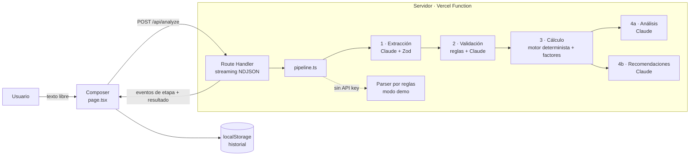

# Arquitectura — EcoTrack AI

> v1 (Iteración 0, diseño inicial). Se actualiza al final de cada iteración que cambie la arquitectura.

## Decisión tecnológica

| Necesidad | Elección | Por qué | Alternativas descartadas |
|---|---|---|---|
| Herramienta de Vibe Coding | **Claude Code** (agente principal + sub-agentes generadores) | Está disponible en el entorno, trabaja sobre el repo real, ejecuta build/test y deja trazabilidad (cada prompt se guarda y se ejecuta tal cual). | Bolt.new / v0 / Replit: requieren cuentas y trabajo manual en navegador, y la evidencia quedaría fuera del repo. |
| Framework | **Next.js (App Router) + TypeScript** | Frontend y backend (route handler) en un mismo proyecto; la API key queda en el servidor; despliegue nativo en Vercel. | Vite + backend aparte: dos despliegues para un MVP. |
| Estilos | **Tailwind CSS** | Rapidez para iterar la UI con lenguaje natural ("más minimalista, más verde") sin archivos CSS dispersos. | CSS Modules: más lento de iterar. |
| IA | **Claude API** (`@anthropic-ai/sdk`, `claude-opus-5`) con salidas estructuradas + **Zod** | Extracción fiable a JSON validado por esquema; buena comprensión del español coloquial. | Regex/NLP clásico: frágil con lenguaje natural (se conserva sólo como modo demo). |
| Cálculo | Módulo TypeScript puro + **Vitest** | Determinista, testeable, defendible. | Pedir el cálculo al LLM: no verificable. |
| Persistencia | `localStorage` | El MVP no necesita cuentas; el historial es personal. | Base de datos: sobre-arquitectura. |
| Despliegue | **Vercel** | Integración directa con Next.js y variables de entorno. | Render/Railway: más configuración. |

## Diagrama de componentes

## Flujo de datos

1. El cliente envía `{ text }`.
2. El servidor emite `{"type":"stage","stage":"extract","status":"running"}` … por cada etapa.
3. Resultado final `{"type":"result","data":{ items, validation, receipt, analysis, recommendations, mode }}`.
4. Errores `{"type":"error","code":"...","message":"..."}` con mensajes en español.

## Principio clave

> **La IA interpreta y explica. El código calcula.**

Así cada kg de CO₂e mostrado es trazable: `cantidad (del usuario o interpretada) × factor (tabla declarada) = resultado`.
