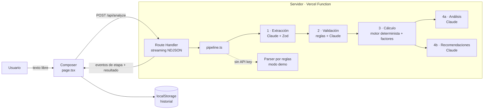

# Arquitectura — EcoTrack AI

> v1 diseñada en la iteración 0; sección "Estado final" añadida en la iteración 8 con lo que realmente se construyó.

## Decisión tecnológica

| Necesidad | Elección | Por qué | Alternativas descartadas |
|---|---|---|---|
| Herramienta de Vibe Coding | **Claude Code** (agente principal + sub-agentes generadores) | Está disponible en el entorno, trabaja sobre el repo real, ejecuta build/test y deja trazabilidad (cada prompt se guarda y se ejecuta tal cual). | Bolt.new / v0 / Replit: requieren cuentas y trabajo manual en navegador, y la evidencia quedaría fuera del repo. |
| Framework | **Next.js (App Router) + TypeScript** | Frontend y backend (route handler) en un mismo proyecto; la API key queda en el servidor; despliegue nativo en Vercel. | Vite + backend aparte: dos despliegues para un MVP. |
| Estilos | **Tailwind CSS** | Rapidez para iterar la UI con lenguaje natural ("más minimalista, más verde") sin archivos CSS dispersos. | CSS Modules: más lento de iterar. |
| IA | **Claude API** (`@anthropic-ai/sdk`, `claude-opus-5`) con salidas estructuradas + **Zod** | Extracción fiable a JSON validado por esquema; buena comprensión del español coloquial. | Regex/NLP clásico: frágil con lenguaje natural (se conserva sólo como modo demo). |
| Cálculo | Módulo TypeScript puro + **Vitest** | Determinista, testeable, defendible. | Pedir el cálculo al LLM: no verificable. |
| Persistencia | `localStorage` | El MVP no necesita cuentas; el historial es personal. | Base de datos: sobre-arquitectura. |
| Despliegue | **Vercel** | Integración directa con Next.js y variables de entorno. | Render/Railway: más configuración. |

## Diagrama de componentes

## Flujo de datos

1. El cliente envía `{ text }`.
2. El servidor emite `{"type":"stage","stage":"extract","status":"running"}` … por cada etapa.
3. Resultado final `{"type":"result","data":{ items, validation, receipt, analysis, recommendations, mode }}`.
4. Errores `{"type":"error","code":"...","message":"..."}` con mensajes en español.

## Principio clave

> **La IA interpreta y explica. El código calcula.**

Así cada kg de CO₂e mostrado es trazable: `cantidad (del usuario o interpretada) × factor (tabla declarada) = resultado`.

---

## Estado final (iteración 8)

El diseño inicial se mantuvo; estos son los cambios y precisiones que surgieron al construir:

| Elemento | Cómo quedó | Iteración |
|---|---|---|
| Intérprete intercambiable | Interfaz `Interpreter` (`extract`, `review`, `explain`, `recommend`) con dos implementaciones: `ClaudeInterpreter` (`claude.ts`) y `demoInterpreter` (`demo.ts`, reglas). `getInterpreter(mode)` elige Claude sólo si hay `ANTHROPIC_API_KEY` y `mode !== "demo"`. | 3, 4 |
| Validación en dos capas | `ruleCheck()` determinista (rangos, negativos, cita no presente en el texto) + `review()` de la IA, que además puede **descartar** ítems (`discard`). | 3, 4 |
| Motor de cálculo | Función pura `calculate()`: conversiones (MWh, gal, lb, t, mi, GLP L→kg), horas→km a 20 km/h, vehículos por unidad o en total; negativos y `vehicle_count ≤ 0` van a "No cuantificado". | 3, 6 |
| Contrato del stream (NDJSON) | `stage` (con `mode` opcional en el primer evento) · `result` · `error` (con `retryable` opcional). Campos opcionales añadidos en la iteración 6 sin romper el contrato. | 3, 6 |
| Estado de la UI | Reductor puro `pipeline-state.ts` (conoce el desenlace real), `error-presentation.ts` (qué acciones ofrecer según el error), `data-origin.ts` (etiquetas de origen según el modo). | 6 |
| Presentación del resultado | `ResultSummary` (total + frase de Eco primero) → validación → desglose → recomendaciones → `CarbonReceipt`. En escritorio el recibo se coloca a la izquierda con la grilla. | 7 |
| Transparencia | `Methodology` ("Cómo calculamos") se genera desde `factors.ts` en el servidor. | 7 |
| Configuración de IA | `claude-opus-5`, `output_config.effort = low`, `thinking: adaptive`, `timeout` 30 s, 1 reintento, `maxDuration = 60` en la ruta. | 4 |
| Despliegue | Vercel (proyecto `ecotrack-vibecoding`), producción en https://ecotrack-vibecoding.vercel.app, sin variables de entorno (modo demo). | 8 |

### Riesgos conocidos
- Latencia con Claude: 3 tramos (extracción → validación → análisis ∥ recomendaciones) de hasta 30 s cada uno podrían acercarse a `maxDuration = 60` s. No medido (sin API key).
- El SDK 0.128 envía los `enum` de Zod como descripción: la API no los impone; Zod los valida al recibir y un valor inválido se muestra como "La IA respondió en un formato inesperado".
